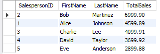
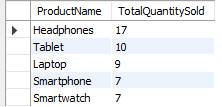
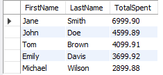
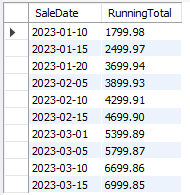
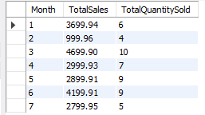
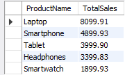

# Sales Performance Analysis

## Project Overview
This project is designed to analyze sales data in order to evaluate the performance of salespeople, products, and customers. By leveraging SQL, it explores real-world business questions using advanced SQL techniques, including Common Table Expressions (CTEs), window functions, and views. The project involves creating a relational database with well-structured tables and running queries to extract insights that drive data-backed decision-making.

## Problem Statement
The primary goal of this project is to analyze the sales performance of a company. The business questions addressed in this analysis are:
- What is the total sales made by each salesperson?
- Which products are the most sold?
- Which customers are buying the most and generating the highest revenue?
- How can we track the growth in sales over time?
- How can we calculate running totals and averages using window functions?

These questions are explored through SQL queries that manipulate and analyze data across multiple related tables.

## Tables in the Database
The database consists of four main tables: `Customers`, `Products`, `Salespersons`, and `Sales`. Below is the schema for each table.

### 1. Customers
Stores customer details like name, contact information, and address.
| Column Name  | Data Type     | Constraints                   |
|--------------|---------------|-------------------------------|
| CustomerID   | INT           | PRIMARY KEY, AUTO_INCREMENT   |
| FirstName    | VARCHAR(50)   | NOT NULL                      |
| LastName     | VARCHAR(50)   | NOT NULL                      |
| Email        | VARCHAR(100)  |                               |
| PhoneNumber  | VARCHAR(15)   |                               |
| Address      | VARCHAR(255)  |                               |


### 2. Products
Contains details about the products, including name, category, and price.
| Column Name  | Data Type     | Constraints                   |
|--------------|---------------|-------------------------------|
| ProductID    | INT           | PRIMARY KEY, AUTO_INCREMENT   |
| ProductName  | VARCHAR(100)  | NOT NULL                      |
| Category     | VARCHAR(50)   |                               |
| Price        | DECIMAL(10, 2)| NOT NULL                      |


### 3. Salespersons
Holds salesperson information including their contact details.
| Column Name  | Data Type     | Constraints                   |
|--------------|---------------|-------------------------------|
| SalespersonID| INT           | PRIMARY KEY, AUTO_INCREMENT   |
| FirstName    | VARCHAR(50)   | NOT NULL                      |
| LastName     | VARCHAR(50)   | NOT NULL                      |
| Email        | VARCHAR(100)  |                               |


### 4. Sales
Tracks each sales transaction, including the date, quantity sold, and total amount, along with foreign keys linking to the `Customers`, `Products`, and `Salespersons` tables.
| Column Name  | Data Type     | Constraints                   |
|--------------|---------------|-------------------------------|
| SaleID       | INT           | PRIMARY KEY, AUTO_INCREMENT   |
| SaleDate     | DATE          | NOT NULL                      |
| CustomerID   | INT           | FOREIGN KEY (References `Customers(CustomerID)`) |
| ProductID    | INT           | FOREIGN KEY (References `Products(ProductID)`) |
| SalespersonID| INT           | FOREIGN KEY (References `Salespersons(SalespersonID)`) |
| QuantitySold | INT           | NOT NULL                      |
| TotalAmount  | DECIMAL(10, 2)| NOT NULL                      |


## SQL Queries and Analysis
The SQL queries below are used to answer key business questions and generate insights.

### 1. Total Sales by Each Salesperson
This query calculates the total sales made by each salesperson:
```sql
SELECT
    s.SalespersonID,
    sp.FirstName,
    sp.LastName,
    SUM(s.TotalAmount) AS TotalSales
FROM Sales s
JOIN Salespersons sp ON s.SalespersonID = sp.SalespersonID
GROUP BY s.SalespersonID
ORDER BY TotalSales DESC;
```
<details>
  <summary>View Output</summary>

</details>


### 2. Most Sold Products
This query identifies which products have been sold the most in terms of quantity:
```sql
SELECT
    p.ProductName,
    SUM(s.QuantitySold) AS TotalQuantitySold
FROM Sales s
JOIN Products p ON s.ProductID = p.ProductID
GROUP BY p.ProductName
ORDER BY TotalQuantitySold DESC;
<details>
  <summary>View Output</summary>

</details>
```

### 3. Customer Spending
This query determines which customers have spent the most:
```sql
SELECT
    c.FirstName,
    c.LastName,
    SUM(s.TotalAmount) AS TotalSpent
FROM Sales s
JOIN Customers c ON s.CustomerID = c.CustomerID
GROUP BY c.CustomerID
ORDER BY TotalSpent DESC;
```
<details>
  <summary>View Output</summary>

</details>

### 4. Sales Growth Over Time (Window Function)
To analyze sales growth, we can calculate the running total of sales using a window function:
```sql
SELECT
    SaleDate,
    SUM(TotalAmount) OVER (ORDER BY SaleDate) AS RunningTotal
FROM Sales
ORDER BY SaleDate;
```
<details>
  <summary>View Output</summary>

</details>

### 5. Sales Performance by Month (View)
A view to summarize the sales performance by month, showing total sales and quantity sold:
```sql
CREATE VIEW SalesPerformanceByMonth AS
SELECT
    MONTH(SaleDate) AS Month,
    SUM(TotalAmount) AS TotalSales,
    SUM(QuantitySold) AS TotalQuantitySold
FROM Sales
GROUP BY MONTH(SaleDate);

SELECT * FROM salesperformanceanalysis.salesperformancebymonth;
```
<details>
  <summary>View Output</summary>

</details>

### 6. Top Products (CTE)
Using a Common Table Expression (CTE), we can find the top products by total sales.
```sql
WITH TopProducts AS (
    SELECT
        p.ProductName,
        SUM(s.TotalAmount) AS TotalSales
    FROM Sales s
    JOIN Products p ON s.ProductID = p.ProductID
    GROUP BY p.ProductName
)
SELECT * FROM TopProducts
ORDER BY TotalSales DESC;
```
<details>
  <summary>View Output</summary>

</details>

## Project Structure
The project is organized as follows:

- `queries_result/`: Contains 6 screenshots of the SQL query results.
- `schema.sql`: The SQL script to create the database schema.
- `insert_data.sql`: The SQL script to insert sample data into the tables.
- `queries.sql`: Contains the SQL scripts used to solve the business problems.
- `README.md`: This file, explaining the project, problem statement, SQL queries, and analysis.


## Conclusion

This project demonstrates the use of SQL for analyzing sales performance and answering key business questions. By applying advanced SQL techniques such as CTEs, window functions, and views, the project showcases a strong understanding of relational databases and data analysis.